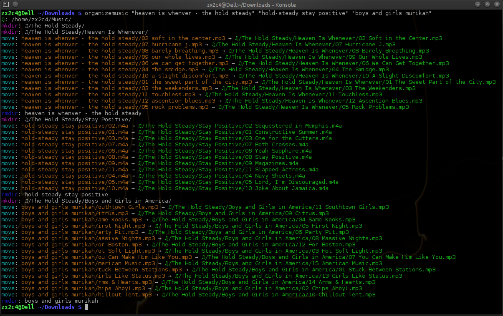

# Music File Organizer

## Introduction

I've been using this utility since I wrote it 6 years ago, and this afternoon, I cleaned up the code base in order to release it. It's a simple command-line music file organizer. It takes a list of files or directories as program arguments, inspects the tags of all the enclosed music files, and then determines which directories need to be created and what the music file name should be. Plenty of GUI tools do this already, many of which are very customizable, but I have yet to see a command-line utility as simple as this that gets the job done.

The general ingestion routine for acquiring music on the Interwebs is I load it up in <a href="http://musicbrainz.org/doc/MusicBrainz_Picard/">Picard</a> or <a href="http://easytag.sourceforge.net/">EasyTag</a> or another command line utility to adjust the tags, and then run:

    $ organizemusic ~/Downloads/some-silly-m4a-directory

And presto, all the music is moved into the right place.

It takes care of translating difficult non ASCII character into correct transliterations using <a href="http://site.icu-project.org/">libicu</a> and uses KDE Scott Wheeler's <a href="http://taglib.github.com/">taglib</a> for the audio file tag reading.

## Utilities

This project ships two very simple utilities for organizing music files.

### `organizemusic`
This scans recursively all directories and files given as arguments and determines the tags of the audio files. It uses these tags to generate a file name and directory sstructure, normalizes the name to remove non ASCII characters, and then moves the files to their new location inside `$MUSICDIR` or `$HOME/Music`.

    $ organizemusic ~/Downloads/Some-Torrent-Directory/ ~/Desktop/file-from-friend.mp3

### `readmusictags`
This spits out all the tag data inside the music files given as arguments.

    $ readmusictags ~/some-music-file.flac ~/files/another_music-file.wma

## Build Requirements

* taglib - http://taglib.github.com/
* libicu - http://site.icu-project.org/

## Build Instructions

    $ make
